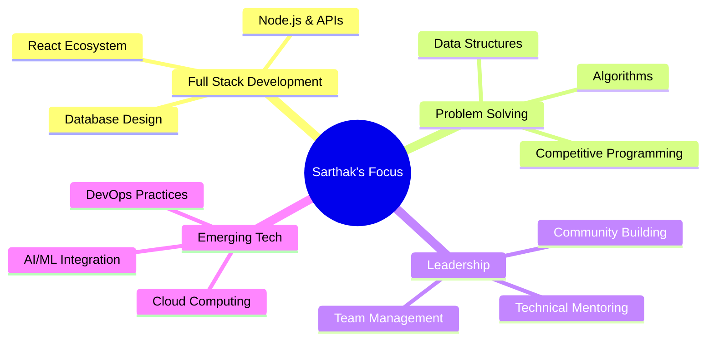

<div align="center">
  
</div>

<div align="center">
  
</div>

---

## 🚀 About Me


I'm a passionate **Full Stack Developer** and **Computer Science student** with a strong foundation in modern web technologies and problem-solving. As the **Joint Technical Head at CSI PCE**, I lead technical initiatives and mentor fellow developers while continuously expanding my expertise in cutting-edge technologies.

### 🎯 Quick Facts
- 🔭 **Currently Building:** Scalable web applications and contributing to open source
- 🌱 **Learning:** React Native, DevOps, and Advanced System Design  
- 👯 **Open to:** Collaboration on innovative web projects and AI/ML solutions
- 💬 **Ask me about:** Full Stack Development, DSA, and Competitive Programming
- ⚡ **Fun fact:** I've solved 380+ LeetCode problems and love hackathons!

```javascript
const sarthak = {
    title: "Full Stack Developer",
    location: "India",
    education: "Computer Science Student",
    role: "Joint Technical Head @ CSI PCE",
    
    expertise: {
        frontend: ["React", "Next.js", "TypeScript", "TailwindCSS"],
        backend: ["Node.js", "Express.js", "MongoDB", "MySQL"],
        tools: ["Git", "Docker", "AWS", "Vercel"],
        languages: ["JavaScript", "TypeScript", "Java", "Python"]
    },
    
    currentGoals: [
        "Building production-ready applications",
        "Contributing to open source projects", 
        "Mastering system design patterns",
        "Exploring cloud architecture"
    ],
    
    achievements: ["SIH 2024 Finalist", "380+ LeetCode solved", "CSI Technical Head"]
};
```

---

## 🛠️ Tech Stack & Tools

<div align="center">

### Languages


### Frontend Development


### Backend Development


### Databases & Cloud


### Tools & Platforms


</div>

---

## 📊 GitHub Statistics

<div align="center">
  
  
</div>

<div align="center">
  
  
</div>

---

## 🏆 Achievements & Milestones

<div align="center">
  
| Achievement | Description | Impact |
|-------------|-------------|---------|
| 🥇 **SIH 2024 Finalist** | Selected among top teams nationwide in Smart India Hackathon | National Recognition |
| 🎯 **Joint Technical Head @ CSI PCE** | Leading technical initiatives and mentoring students | Leadership & Community |
| 💪 **380+ LeetCode Problems** | Consistent problem-solving and algorithm mastery | Technical Excellence |
| 🚀 **Multiple Full-Stack Projects** | Built and deployed production-ready applications | Practical Experience |
| 👥 **Open Source Contributor** | Active participation in developer community | Collaboration |

</div>

### 💻 Coding Platforms
<div align="center">
  <a href="https://leetcode.com/SarthakVitmal/">
    
  </a>
</div>

---

## 🎯 Current Focus Areas

<div align="center">



</div>

**🔥 What I'm Working On:**
- Building scalable web applications with modern tech stacks
- Solving complex algorithmic challenges daily
- Leading technical projects at CSI PCE
- Contributing to open source projects
- Learning cloud architecture and DevOps practices

---

## 🤝 Let's Connect!

<div align="center">
  
[](https://linkedin.com/in/sarthak-vitmal)
[](https://leetcode.com/SarthakVitmal/)
[](mailto:sarthak.vitmal.dev@gmail.com)
[](https://sarthakvitmal.vercel.app)

**💬 Open to discussing:** Full Stack Development, Technical Leadership, Open Source Collaboration, and Innovative Project Ideas

</div>

<div align="center">
  
</div>

---

<div align="center">
  
### 💡 "Great developers are not born, they are forged through consistent practice and continuous learning."

**Thank you for visiting my profile! Let's build something amazing together! 🚀**


</div>
